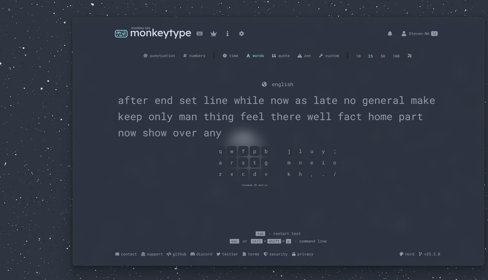

# Transparent Monkeytype
Electron app generated by [Nativefier](https://github.com/nativefier/nativefier)

You can replace the `icon.ico` file with the one you'd like.
In `build.ps1`, you can change the color of the background. The hex code is #ttrrggbb where tt is transparency (I use [MicaForEveryone](https://github.com/MicaForEveryone/MicaForEveryone/) and [DWMBlurGlass](https://github.com/Maplespe/DWMBlurGlass) on windows to achieve a Mica blurred background)

The window can be moved by dragging the MonkeyType logo

`npm install -g nativefier`

`git clone https://github.com/steven-na/transparent-monkeytype.git`

(In powershell) `./build.ps1`

